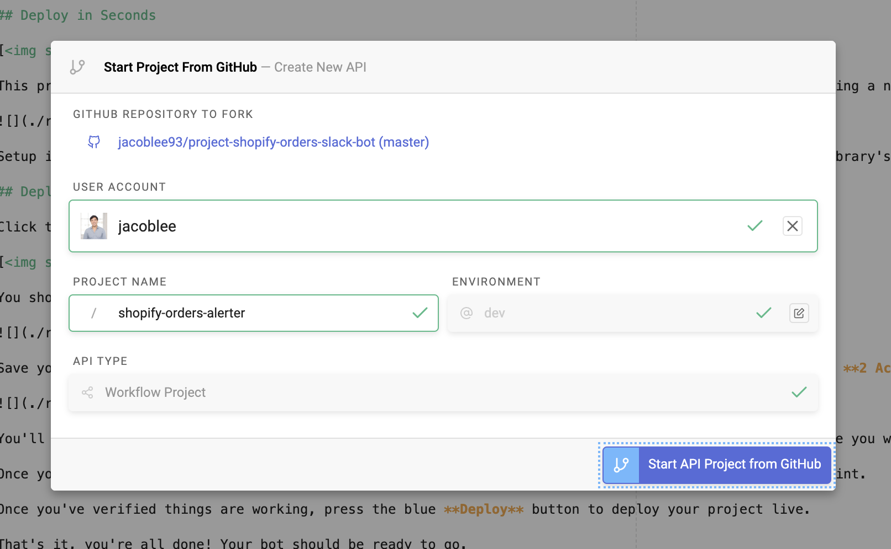

# Shopify Order Notification Slack Bot

## Deploy in Seconds

This project is code for a Slack bot that will respond to newly created orders in a Shopify store by sending a notification.

Setup is simple –– you can deploy it without writing any code or configuring any files due to Standard Library's [Identity Token](https://docs.stdlib.com/identity-management-sso-for-apis/what-is-an-identity-token/) support! The only things you need to do are to link your Shopify store and Slack workspace to Standard Library, then deploy!

## Deploying to Standard Library

Click the button below to open this repo in [Autocode](https://autocode.stdlib.com/):

You should see a screen like this:

Save your project, then open `functions/events/shopify/orders/create.js` in the sidebar and click the red **2 Accounts Required** button in the lower right corner.

You'll then see a modal appear that will prompt you to link your Shopify store and a Slack workspace where you would like to receive notifications.

Once you've linked the required resources, you can press the green **Run Code** button to test your endpoint.

Once you've verified things are working, press the blue **Deploy** button to deploy your project live.

That's it, you're all done! Your bot should be ready to go.

# Thank You!

Please check out [Standard Library](https://stdlib.com/) or follow us on Twitter,
[@StdLibHQ](https://twitter.com/@StdLibHQ).
